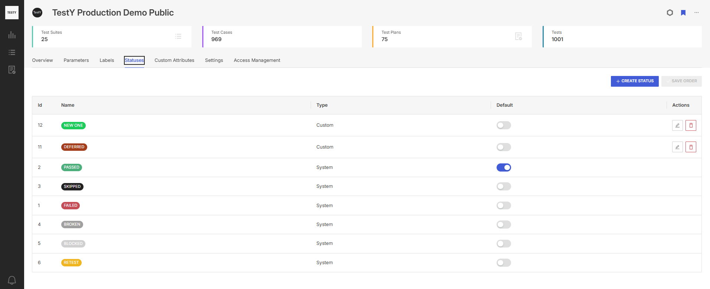

.. _statuses:

================
Вкладка Statuses
================

На вкладке **Statuses** доступно управление статусами тестовых
результатов, в том числе:

- создание дополнительных статусов для тестовых результатов;
- выбор статуса по умолчанию;
- изменение порядка отображения статусов.

|image21|

Пользователь может создать неограниченное количество пользовательских
статусов в дополнение к системным. При создании статуса необходимо
указать название и выбрать цвет статуса. Пользователю доступны
рекомендованные цвета для дополнительных статусов, а также цветовая
палитра. Выбранный цвет будет одинаково отображаться в темной и светлой
темах интерфейса.

Пользователь может расположить статусы в произвольном порядке. Порядок
статусов влияет на их отображение при добавлении тестового
результата. 

Пользователь может выбрать статус по умолчанию. Статус, выбранный
статусом по умолчанию, автоматически проставляется в новый добавленный
результат. Если статус по умолчанию не выбран, при добавлении нового
тестового результата поле статус будет пустым и обязательным для
заполнения.

