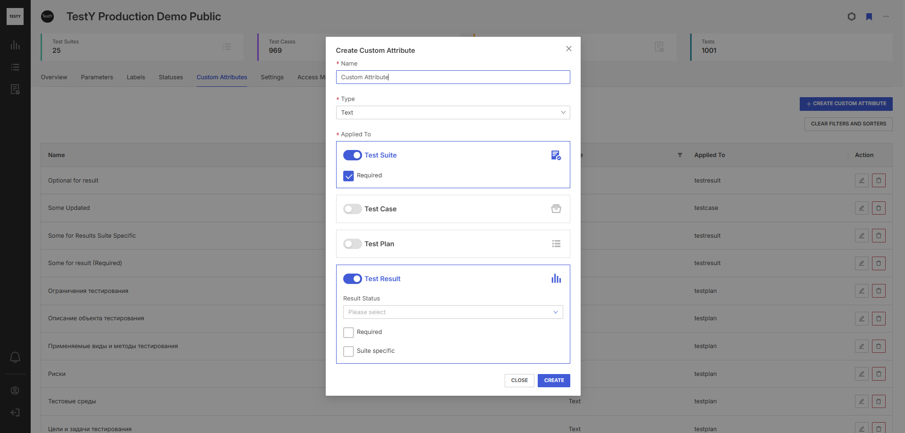

.. _attributes:

=============================
Вкладка Custom Attributes
=============================

На вкладке **Custom Attributes** пользователю доступно управление
дополнительными полями для:

- тестовых наборов,

- тестовых планов,

- тестовых результатов,

- тест-кейсов.

Чтобы создать пользовательский атрибут:

1. На вкладке **Custom Attributes** нажмите |image22|.

2. Заполните имя атрибута, его тип и выберите хотя бы один объект
   системы (Test Suite / Test Case / Test Plan / Test Result), к
   которому будет применяться созданный атрибут. Возможен выбор одного,
   нескольких или сразу всех объектов системы:

 |image23|

3. В зависимости от выбранного объекта системы пользователю доступны
разные варианты конфигурации полей:

.. container:: table-wrap

   +----------------------+----------------------+----------------------+
   | **Настройки поля**   | **Использование**    | **Комментарий**      |
   +----------------------+----------------------+----------------------+
   | **Required**         | Применимо везде      | Созданный атрибут    |
   | (обязательное поле)  |                      | обязателен для       |
   |                      |                      | заполнения.          |
   +----------------------+----------------------+----------------------+
   | **Suite Specific**   | Test Case, Test      | Созданный атрибут    |
   | (определенные        | Result               | доступен для         |
   | тестовые наборы)     |                      | заполнения только в  |
   |                      |                      | тестовых кейсах и    |
   |                      |                      | связанных с ними     |
   |                      |                      | результатах, которые |
   |                      |                      | находятся в          |
   |                      |                      | выбранных тестовых   |
   |                      |                      | наборах.             |
   +----------------------+----------------------+----------------------+
   | **Status** (статус   | Test Result          | Созданный атрибут    |
   | тестового            |                      | доступен для         |
   | результата)          |                      | заполнения только    |
   |                      |                      | при проставлении     |
   |                      |                      | выбранных статусов   |
   |                      |                      | тестового            |
   |                      |                      | результата.          |
   +----------------------+----------------------+----------------------+

4. Нажмите |image24|

