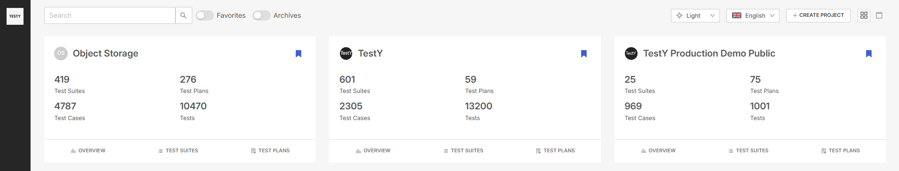

.. _dashboard:

Раздел Dashboard
================

Раздел является стартовой страницей и содержит информацию обо всех
существующих в системе проектах. По умолчанию проекты отображается в
виде плиток, доступно переключение на табличное представление (|image1|)
.

На стартовой странице системы пользователь может выбрать язык
интерфейса, а также один из трёх вариантов темы интерфейса:
* Светлая
* Тёмная
* Системная

Пользователю доступен поиск по проектам. В левой части экрана
расположено поле поиска для навигации в рамках системы:

|image2|

Пользователь может добавить любой проект на стартовой странице в
избранное с помощью кнопки |image3|— такие проекты показываются
пользователю в первую очередь.

В карточке проекта отображается его название, аватар, краткая статистика
и кнопки навигации ( `Overview <#overview>`__ ,
`Test Suites & Cases <#test-suites-cases>`__ и `Test
Plans & Results <#test-plans-results>`__ ).

Нажав на название проекта, пользователь переходит на вкладку
**Overview**, на которой представлена сводная информация по проекту, а также доступно администрирование проекта (администрирование проекта описано в разделе :ref:`project_administration`).

|projectOverview|

В правом верхнем углу страницы пользователю доступно добавление проекта
в избранное, а так же кнопка настроек проекта,
нажатие на которую открывает модальное окно для редактирования общей информации о проекте.

.. |projectOverview| image:: ../../static/projectOverview.png
   :class: confluence-embedded-image
   :width: 1000px

