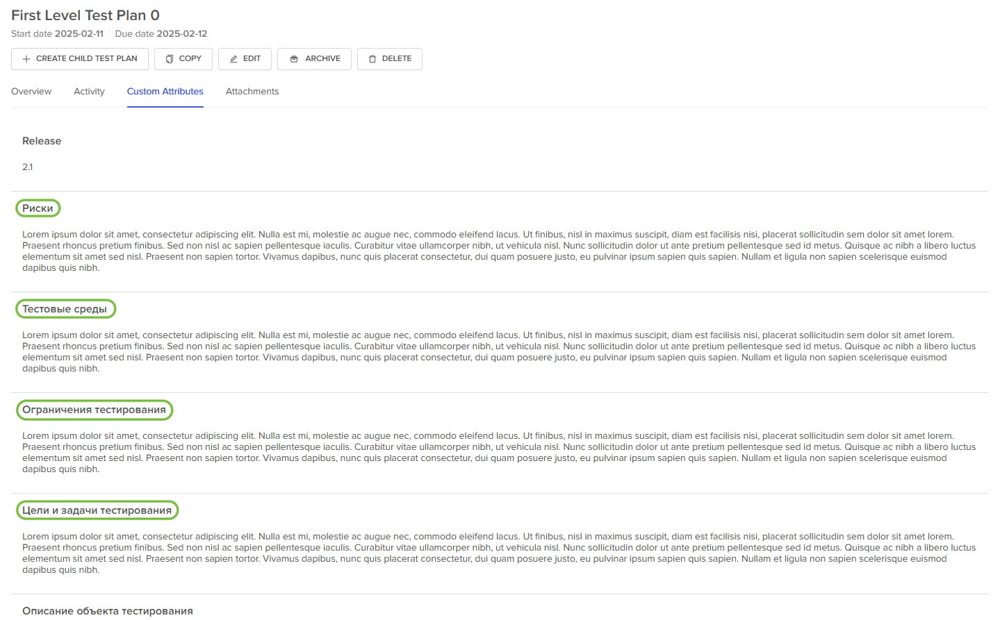
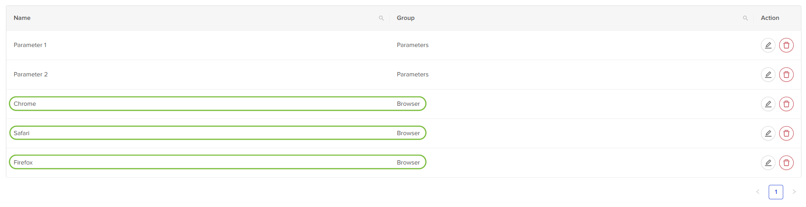
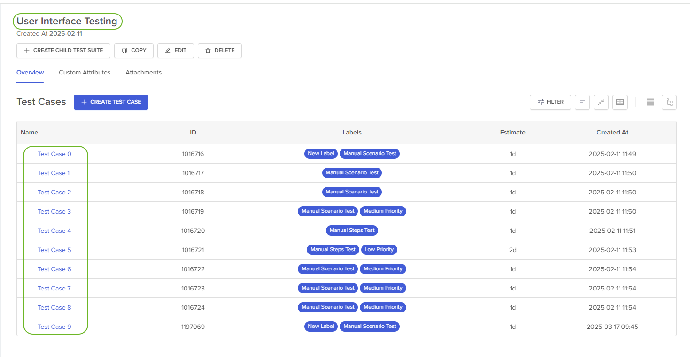
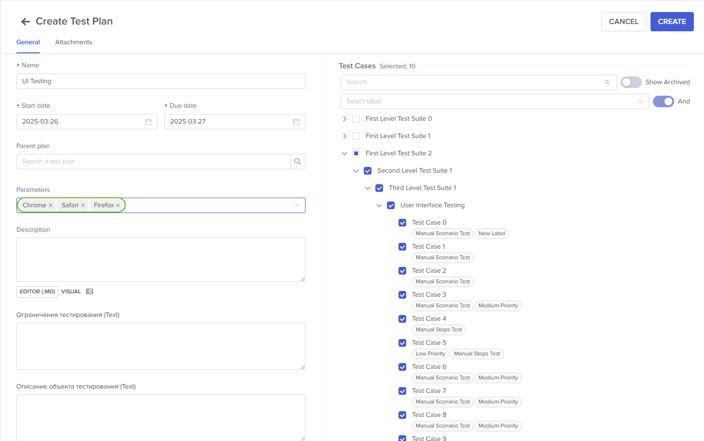
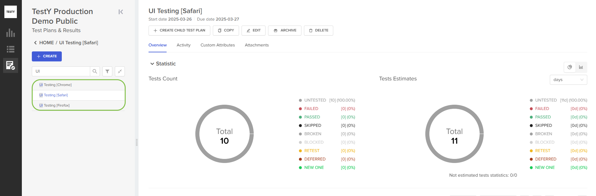
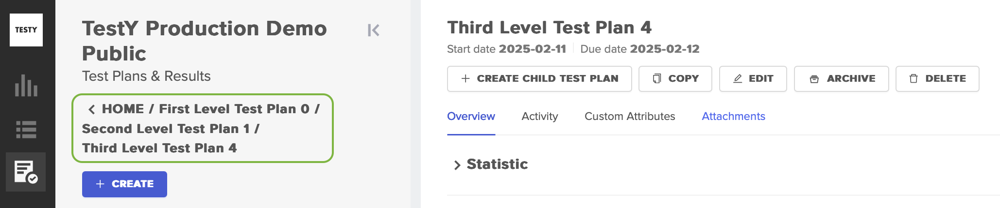
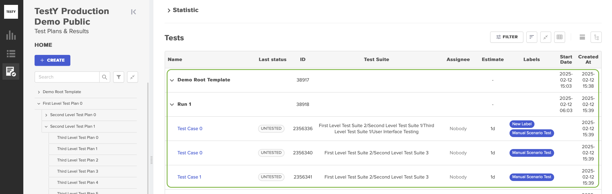
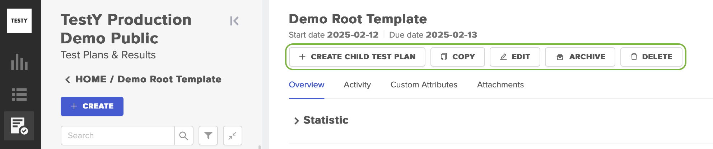
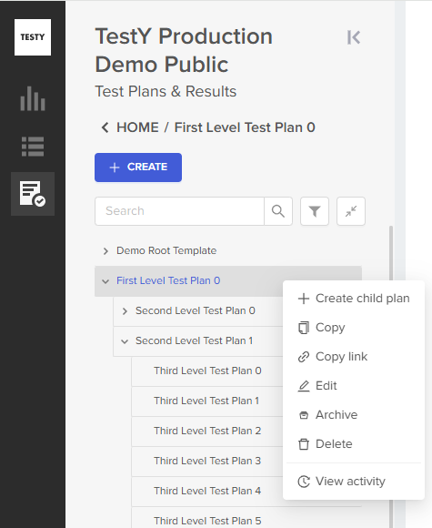

===============
Тестовые Планы
===============

Описание
~~~~~~~~

Тестовый план в системе TestY TMS представляет собой набор тестов,
запланированный к выполнению. Например, *Тест План* для тестирования
релиза *XYZ*.

Параметры тестового плана по умолчанию:

.. container:: table-wrap

   +------------------+-------------------+-----------------------------+
   | Параметр         | **Применимость**  | Описание                    |
   +------------------+-------------------+-----------------------------+
   | **Name**         | Обязательное поле | Имя тестового плана.        |
   +------------------+-------------------+-----------------------------+
   | **Description**  | Опциональное поле | Текстовое поле с описанием  |
   |                  |                   | тестового плана. Доступно   |
   |                  |                   | добавление вложений.        |
   +------------------+-------------------+-----------------------------+
   | **Stard Date**   | Обязательное поле | Дата предполагаемого начала |
   |                  |                   | выполнения тестового плана. |
   +------------------+-------------------+-----------------------------+
   | **Due Date**     | Обязательное поле | Дата предполагаемого        |
   |                  |                   | завершения выполнения       |
   |                  |                   | тестового плана.            |
   +------------------+-------------------+-----------------------------+
   | **Tests**        | Опциональное поле | Список тестов, включаемых в |
   |                  |                   | тестовый план. Список       |
   |                  |                   | тестов представлен в виде   |
   |                  |                   | дерева, выбор               |
   |                  |                   | осуществляется              |
   |                  |                   | проставлением чек-боксов.   |
   |                  |                   | Доступна фильтрация тестов  |
   |                  |                   | по лейблам, а также поиск   |
   |                  |                   | по тестам.                  |
   +------------------+-------------------+-----------------------------+
   | **Parameters**   | Опциональное поле | Параметры, которые будут    |
   |                  |                   | использованы при создании   |
   |                  |                   | плана. В случае если выбран |
   |                  |                   | один или более параметров.  |
   |                  |                   | :ref:`Подробнее о           |
   |                  |                   | параметризированных         |
   |                  |                   | тестовых                    |
   |                  |                   | планах <params>`            |
   +------------------+-------------------+-----------------------------+
   | **Parent plan**  | Опциональное поле | Если параметр заполнен,     |
   |                  |                   | тест-план будет создан как  |
   |                  |                   | дочерний к выбранному       |
   |                  |                   | тест-плану. Если поле       |
   |                  |                   | оставлено пустым, будет     |
   |                  |                   | создан корневой тест-план.  |
   +------------------+-------------------+-----------------------------+

В случае необходимости, аналогично тестовым наборам, набор параметров по
умолчанию может быть расширен с помощью пользовательских атрибутов.
Заполнение/редактирование дополнительных параметров доступно в форме
создания/редактирования тестового плана. Заполненные параметры
отображаются на отдельной вкладке **Custom Attributes**.

Использование дополнительных параметров, позволяет добавить к тест-плану
различные текстовые разделы, из которых состоит классический тест-план.
Например, описание объекта тестирования, лимиты, предположения,
допущения, требования к окружению, критерии входа/выхода и другие:

|image55|

Как и для тестовых наборов, система поддерживает вложенность
тест-планов:

|image56|

.. _params:

Создание параметризированных тестовых планов
~~~~~~~~~~~~~~~~~~~~~~~~~~~~~~~~~~~~~~~~~~~~

В случае, если при создании тестового плана выбран один или более
параметров, :ref:`созданных на вкладке Administration <admin_params>`, после нажатия
**CREATE** будет создан не один тестовый план, а по одному тестовому
плану для каждого выбранного параметра.

**Пример**

В приведенном примере применены следующие условия:

- Объектом тестирования является веб-приложение, которое должно работать
  в evergreen-версиях основных браузеров (Chrome, Firefox, Safari). Эти
  браузеры заведены в проекте в качестве параметров для тестовых планов:

|image57|

- Подготовлены набор/наборы тестов, которые предназначены для
  тестирования пользовательского интерфейса:

|image58|

- Предполагается прохождение тестов на разных браузерах. В таком случае
  в качестве параметров выступают браузеры Chrome, Firefox, Safari:

|image59|

- При выборе этих параметров в форме создания тестового плана после
  нажатия на кнопку **CREATE** в системе появляется три тестовых плана
  UI Testing (Chrome), UI Testing (Firefox), UI Testing (Safari):

|image60|

Навигация по тестовым планам
~~~~~~~~~~~~~~~~~~~~~~~~~~~~

Для навигации по тестовым планам можно использовать боковую панель,
расположенную в левой части экрана. Боковая панель масштабируется и
сворачивается. Пользователю доступна фильтрация по имени тестового плана
и сортировка. Пользователь может перейти на любой уровень тестовых
планов. При навигации в верхней части доступна навигационная цепочка,
которая может использоваться для возврата на предыдущий уровень:

|image61|

Также для навигации может использоваться правая часть в древовидном
представлении. При нажатии на название тестового плана выбранный
тестовый план становится корневым и выстраивает от себя дерево
зависимостей:

|image62|

Для создания дочерних планов, копирования тестового плана и прочих
действий можно использовать кнопки, расположенные в шапке тестового
плана:

|image63|

На странице тестового плана также представлены:

- Название тестового плана;
- Даты начала и предполагаемого завершения тестового плана;
- Кнопки действий, доступных для тест-плана;
- Вкладки **Overview**, **Activity**, **Custom Attributes**,
  **Attachments**.

Все действия также доступны пользователю в меню, открывающемся при
нажатии правой кнопки мыши на название тестового плана в боковой панели:

|image64|

.. |image56| image:: ../../static/image56.png
   :class: confluence-embedded-image
   :width: 1000px

