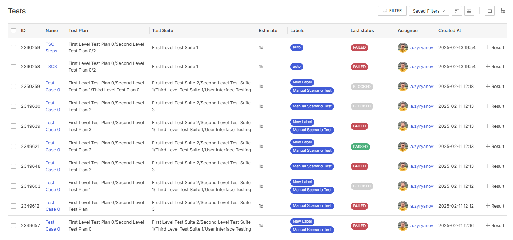
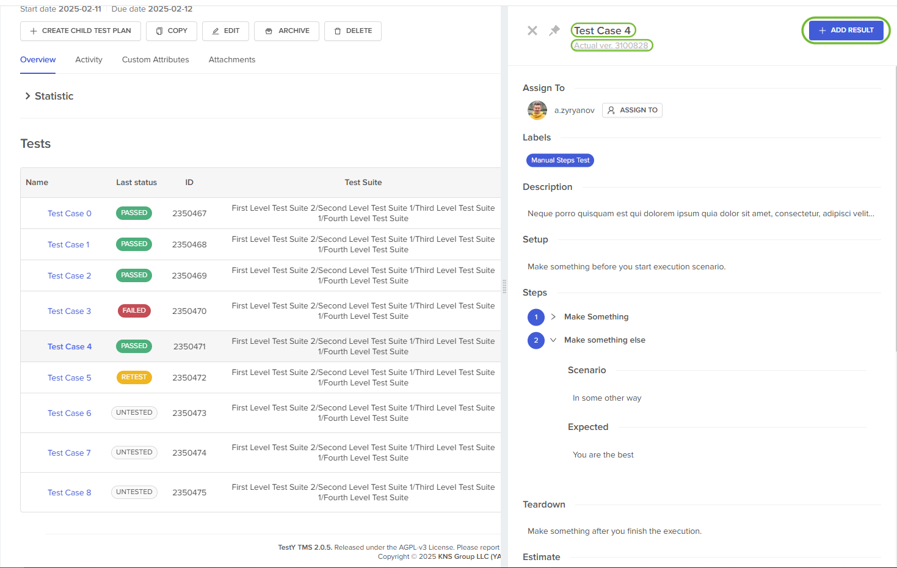
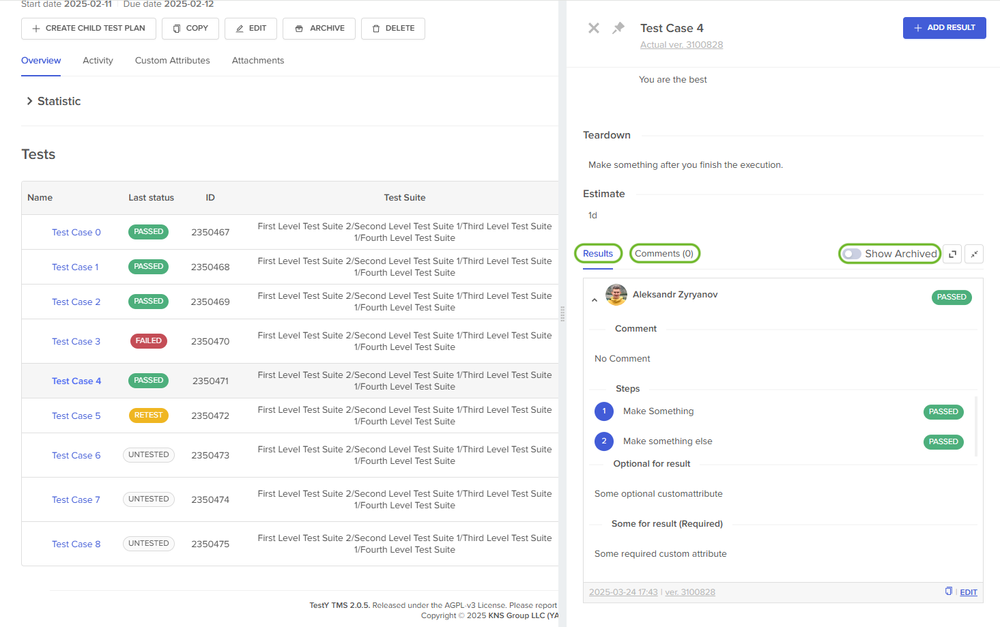
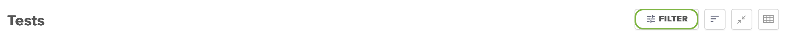
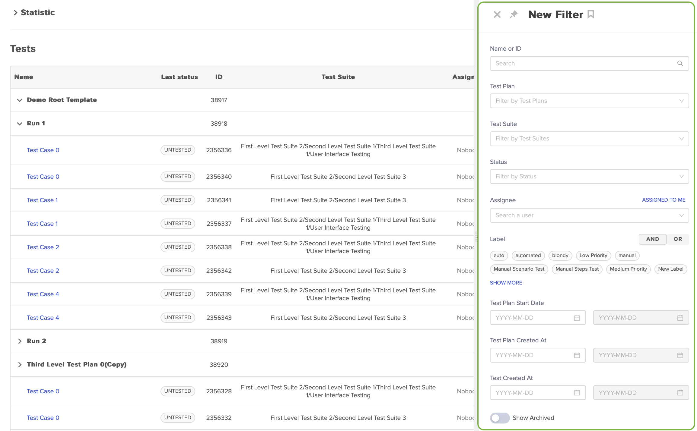
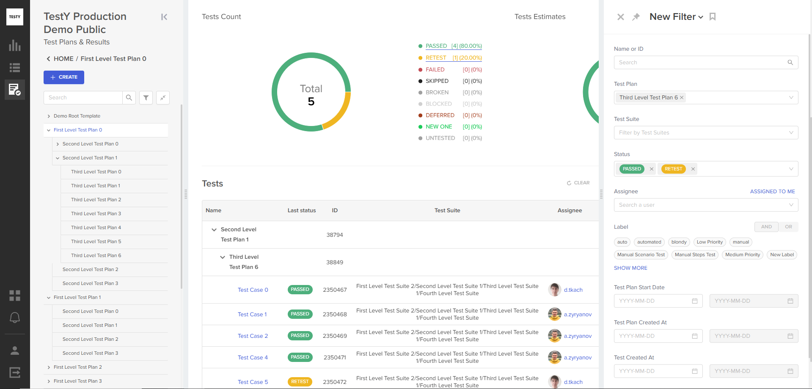

Раздел Tests
============

Под блоком статистики отображаются тесты, добавленные в тест-план.
Аналогично другим разделам, доступно два варианта представления:

- табличное,
- древовидное.

В табличном представлении все тесты отображаются в плоской структуре. В
таблице представлены все тесты от выбранного тестового плана и вниз до
последнего дочернего тестового плана включительно. Если родительский
тестовый план не выбран, отображаются все тесты, добавленные во все
тест-планы в проекте. Табличное представление дополнено пагинацией,
количество элементов для показа 10-50-100:

|image69|

Столбцы в табличном представлении:

.. container:: table-wrap

   +-----------------+---------------------------------------------------+
   | **Столбец**     | **Описание**                                      |
   +-----------------+---------------------------------------------------+
   | **ID**          | Идентификатор тест-кейса.                         |
   +-----------------+---------------------------------------------------+
   | **Name**        | Имя тест-кейса.                                   |
   +-----------------+---------------------------------------------------+
   | **Test Plan**   | Тестовый план, в котором находится тест.          |
   +-----------------+---------------------------------------------------+
   | **Test Suite**  | Тестовый набор, в котором расположен              |
   |                 | ассоциированный тест-кейс.                        |
   +-----------------+---------------------------------------------------+
   | **Estimate**    | Временная оценка теста.                           |
   +-----------------+---------------------------------------------------+
   | **Labels**      | Метки, добавленные к тест-кейсу.                  |
   +-----------------+---------------------------------------------------+
   | **Last Status** | Статус последнего результата, добавленного к      |
   |                 | тесту.                                            |
   +-----------------+---------------------------------------------------+
   | **Assignee**    | Пользователь, на которого назначен тест.          |
   +-----------------+---------------------------------------------------+
   | **Created At**  | Дата добавления теста в тест-план.                |
   +-----------------+---------------------------------------------------+
   | **+ Result**    | Открывает форму добавления результата.            |
   +-----------------+---------------------------------------------------+

В древовидном представлении по умолчанию отображаются тесты, находящиеся
в выбранном родительском плане, дочерние планы по умолчанию свернуты:

|image70|

Дочерние планы можно развернуть до любого уровня вложенности. Выбранные
настройки представления в дальнейшем сохраняются.

Столбцы в древовидном представлении:

.. container:: table-wrap

   +-----------------+---------------------------------------------------+
   | **Столбец**     | **Описание**                                      |
   +-----------------+---------------------------------------------------+
   | **Name**        | Имя тест-плана или теста в нем.                   |
   +-----------------+---------------------------------------------------+
   | **Last Status** | Статус последнего результата, добавленного к      |
   |                 | тесту.                                            |
   +-----------------+---------------------------------------------------+
   | **ID**          | Идентификатор теста или тест-плана.               |
   +-----------------+---------------------------------------------------+
   | **Test Suite**  | Тестовый набор, в котором расположен              |
   |                 | ассоциированный тест-кейс.                        |
   +-----------------+---------------------------------------------------+
   | **Assignee**    | Пользователь, на которого назначен тест.          |
   +-----------------+---------------------------------------------------+
   | **Estimate**    | Временная оценка теста.                           |
   +-----------------+---------------------------------------------------+
   | **Labels**      | Метки, добавленные к тест-кейсу.                  |
   +-----------------+---------------------------------------------------+
   | **Start Date**  | Дата начала тест-плана.                           |
   +-----------------+---------------------------------------------------+
   | **Created At**  | Дата создания тест-плана или добавления в него    |
   |                 | теста.                                            |
   +-----------------+---------------------------------------------------+

   .. container:: confluence-information-macro-body

      Набор столбцов и для табличного и древовидного представления можно
      изменять с помощью меню, расположенного над представлением в
      правой части экрана. В меню доступна сортировка элементов
      представления, фильтр и переключение представлений.

При нажатии на название теста открывается правая боковая панель с
детальной информацией, которая содержит:

- Название теста.
- Версия ассоциированного тест-кейса.
- Информация из ассоциированного тест-кейса.
- Кнопка добавления результата.
- В правой части правой боковой панели:

  - Результаты, добавленные к тесту — по умолчанию показывается
    последний.
  - Комментарии к тесту.
  - Переключатель **Show Archived** для отображения архивированных
    результатов.

|image71|

|image72|

Добавление нового результата (Test Result)
~~~~~~~~~~~~~~~~~~~~~~~~~~~~~~~~~~~~~~~~~~

#. Чтобы добавить результат, нажмите **ADD RESULT**.

Откроется форма добавления результата:

|addResultForm|

2. Заполните параметры:

   .. container:: confluence-information-macro-body

      Помимо основных параметров форма может содержать дополнительные
      пользовательские параметры, :ref:`сконфигурированные на уровне
      проекта <attributes>`.

   +-------------------------------+-------------------------------------+
   | **Параметр**                  | **Описание**                        |
   +-------------------------------+-------------------------------------+
   | **Status**                    | Выбор статуса для добавляемого      |
   |                               | результата. По умолчанию поле не    |
   |                               | заполнено. Доступен выбор из        |
   |                               | статусов, настроенных на уровне     |
   |                               | проекта. Если в настройках проекта  |
   |                               | выбран статус по умолчанию, статус  |
   |                               | будет автоматически применен сразу  |
   |                               | после открытия формы добавления     |
   |                               | результата.                         |
   |                               |                                     |
   |                               | Настройка статусов описана в        |
   |                               | соответствующем                     |
   |                               | :ref:`разделе <statuses>`           |
   +-------------------------------+-------------------------------------+
   | **Status** — для каждого шага | Для тестов, которые содержат шаги,  |
   |                               | доступен выбор отдельного статуса   |
   |                               | для каждого шага. Поведение и       |
   |                               | значение по умолчанию аналогичны    |
   |                               | полю с общим статусом результата.   |
   +-------------------------------+-------------------------------------+
   | **Apply to Steps**            | Применяет общий статус ко всем      |
   |                               | шагам.                              |
   +-------------------------------+-------------------------------------+
   | **Comment**                   | Поле для комментария к результату.  |
   |                               | Доступно добавление вложений.       |
   +-------------------------------+-------------------------------------+
   | **Attachments**               | Доступно добавление вложений без    |
   |                               | комментария.                        |
   +-------------------------------+-------------------------------------+
   | **Add Attribute**             | Добавление дополнительных           |
   |                               | пользовательских полей к            |
   |                               | конкретному результату.             |
   +-------------------------------+-------------------------------------+

3. Нажмите **CREATE**.

Действия с добавленными результатами
~~~~~~~~~~~~~~~~~~~~~~~~~~~~~~~~~~~~

В нижней части боковой панели для каждого результата доступно
копирование и изменение результата.

Действия возможны, только когда версия ассоциированного тест-кейса не
была изменена с момента добавления результата.

Изменение результата может быть доступно или не доступно в зависимости
от `соответствующих настроек проекта <#settings>`__.

Фильтрация тестов
~~~~~~~~~~~~~~~~~

Фильтр расположен над списком тестов в правой части экрана:

|image74|

При нажатии на кнопку \ **FILTER**\  открывается правая боковая панель:

|image75|

Строка поиска интегрирована в фильтр и является одним из его сегментов.
Тесты можно фильтровать по сочетанию условий, не зависящих друг от
друга.

Фильтр в разделе **Test Plans & Results** не является иерархическим
и включает в себя следующие сегменты:

- **Name or ID** — строка поиска по имени и ID. Если открыть фильтр, не
  переходя в конкретный тестовый план, поиск будет осуществляться по
  всем тест-планам.
- **Test Plan** — селектор тест-планов. При выборе селектора тест-планов
  доступен переключатель **Show full tree**, который отображает все
  тест-планы вне зависимости от места, в котором открыт фильтр.
- **Test Suite** — селектор тестовых наборов.
- **Status** — статусы тестов. Доступен выбор нескольких статусов с
  условием OR.
- **Assignee** — пользователь, на которого назначен тест. Доступен выбор
  нескольких пользователей с условием OR.
- **Label** — метки тест-кейсов. Доступен выбор нескольких меток с
  применением условий OR/AND/NOT.
- **Test Plan Start At** — временной интервал, позволяющий выбрать
  конкретные тест-планы по дате начала, указанной в плане.
- **Test Plan Created At** — временной интервал от даты фактического
  создания тест-плана.
- **Test Created At** — временной интервал от даты добавления теста в
  тест-план.
- **Show Archived** — архивные тесты.

Фильтры можно сохранять/редактировать/удалять. Сохраненные фильтры
доступны в рамках проекта. Пользователю доступно создание
неограниченного количества фильтров.

В разделе **Test Plans & Results** все сегменты фильтра влияют не
только на табличное и древовидное представление тестов, но и на
статистику:

|image76|

Массовые операции с тестами
~~~~~~~~~~~~~~~~~~~~~~~~~~~

В табличном представлении Tests доступно выполнение массовых операций. 
Выбор тестов для осуществления массовой операции производится с помощью чек-боксов, расположенных в самой левой колонке представления. 
При отметке чек-бокса, который находится в заголовке таблицы, выбираются все элементы вне зависимости от пагинации. 
После выбора хотя бы одного теста, справа от заголовка Tests появляется выпадающее меню Actions, в выпадающем меню представлены доступные операции:
* Move Tests
* Assign To
* Add Results
* Delete

Перенос тестов
""""""""""""""
Массовая операция Move Tests осуществляет перенос выбранных тестов из текущего тест-плана в целевой. 
Для переноса тестов отметьте тесты, которые необходимо перенести. Затем выберете соответствующую опцию в выпадающем меню Actions. 
В открывшемся окне выберете тестовый план, в который необходимо перенести тесты, и нажмите на кнопку Save. 

   .. container:: confluence-information-macro-body
      В случае если выбрано значительное количество тест-кейсов, операция может занять некоторое время.

Изменение назначения тестов
""""""""""""""""""""""""""""

Массовая операция Assign To позволяет назначить группу тестов на пользователя, чтобы не назначать тесты по одному.
Для назначения тестов отметьте тесты, для которых вы хотите изменить назначенного исполнителя. 
Затем выберете опцию Assign To в выпадающем меню Actions. 
В открывшемся окне выберете пользователя, на которого вы хотите назначить тесты (если оставить поле пустым, с выбранных тестов будет снято назначение). Нажмите кнопку Save.

Добавление результатов
""""""""""""""""""""""

Массовая операция Add Results добавляет новый результат к каждому из выбранных тестов.
Отметьте тесты, для которых нужно добавить новый результат и выберете соответствующую опцию в выпадающем меню Actions. 
В открывшейся форме Add Results выберете статус результата и нажмите на кнопку Next. 
На следующем шаге Common Fields заполните значения полей, общих для тестовых результатов в проекте, и нажмите на кнопку Next. 
На шаге Suites Fields заполните поля, специфичные для тестовых наборов, к которым относятся выбранные тесты, и нажмите Next. 
На последнем шаге Additional Fields вы можете добавить комментарий и вложения к результатам. 
После заполнения формы нажмите кнопку Set. 
Через некоторое время к каждому из выбранных тестов будет добавлен соответствующий результат. 

   .. container:: confluence-information-macro-body
      В некоторых случаях операция добавления результата к тестам может занимать значительное время, поэтому она выполняется асинхронно. 
      До завершения операции не рекомендуется инициировать другие массовые действия.   

Удаление тестов
""""""""""""""""
Массовая операция Delete удаляет выбранные тесты из тест-плана.
Для использования операции Delete выберете тесты, которые необходимо удалить из тест-плана. 
В выпадающем меню Actions выберете опцию Delete, подтвердите удаление тестов.
Для подтверждения удаления, необходимо ввести правильное количество тестов, которые будут удалены.

.. |image70| image:: ../../static/image70.png
   :class: confluence-embedded-image
   :width: 1000px

.. |addResultForm| image:: ../../static/addResultForm.png
   :class: confluence-embedded-image
   :width: 550px

